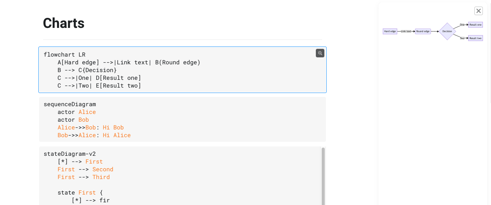
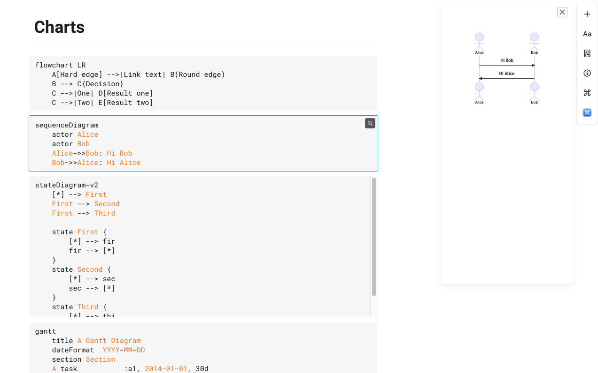
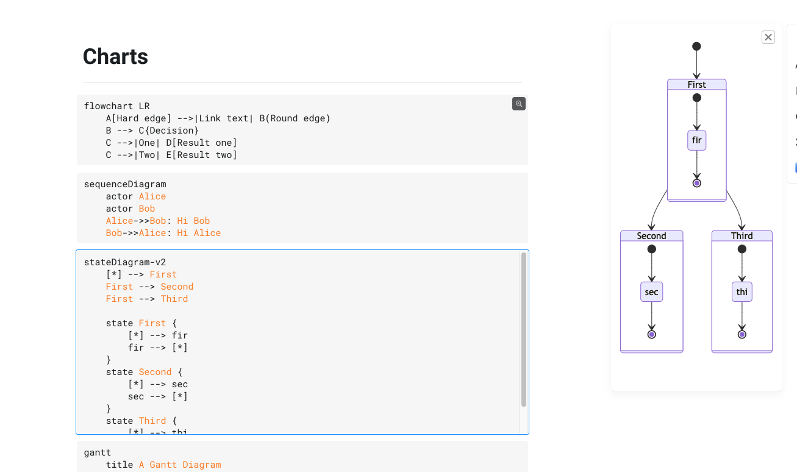

# Craft eXtension - Mermaid
A [Craft](https://www.craft.do/) extension to preview [Mermaid.js](https://mermaid-js.github.io) code blocks.

## Screenshots

## Building

Simply run `npm install` and than `npm run build` to generate the .craftX file which can be installed.
You can use `npm run dev` to test and debug in your local environment

To learn more about Craft eXtensions visit the [Craft X developer portal](https://developer.craft.do).

## Notes
The icon used in this project comes from [Flow icons created by Becris - Flaticon](https://www.flaticon.com/free-icons/flow)
